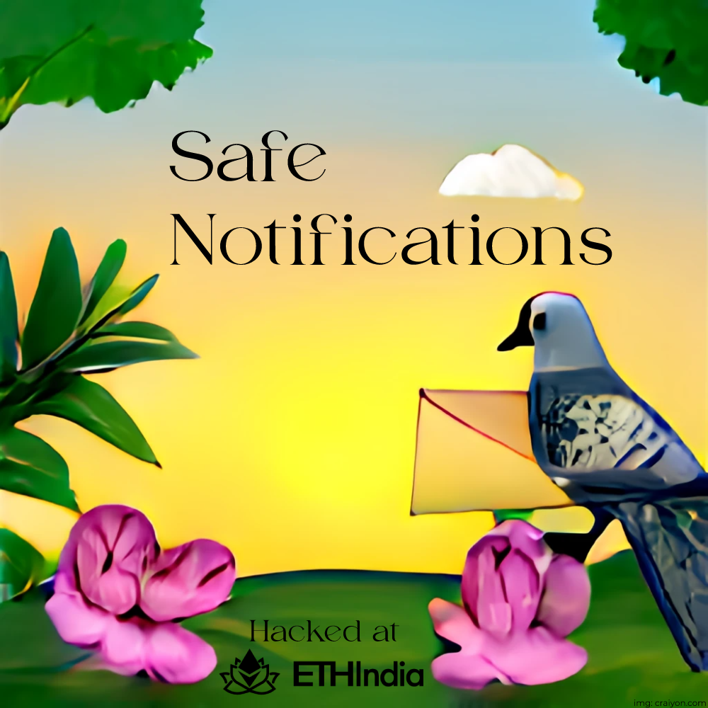

 

  
  <h3 align="center">Safe Notifications</h3>
  

Keep your web3 community up to date with on-chain and off-chain notifications delivered directly from your Safe multisig.
  

 
<small>The image was generated with [DALL•E](https://www.craiyon.com/) text-to-image AI model. Used prompt: illustration of a pigeon delivering a letter in an enchanting garden in India.</small>

## Integrations
- [PUSH](https://push.org/)
- [Safe](https://gnosis-safe.io/)
- [ENS](https://ens.domains/)
- [IDriss](https://www.idriss.xyz/)

